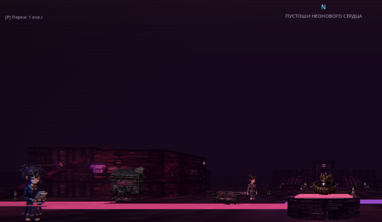
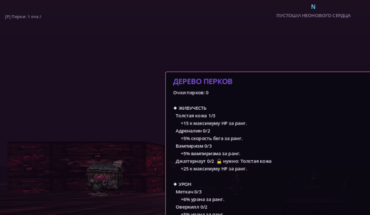
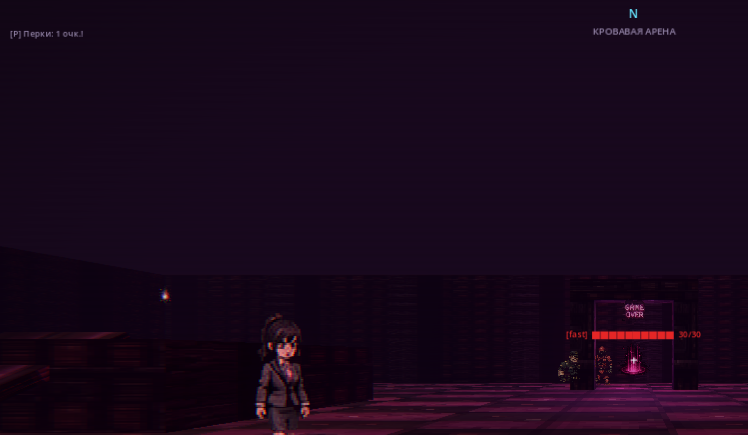

<div align="center">

# 💗 OpenHeart

**2.5D Action-RPG** в духе *DOOM / Forgive Me Father*: полноценный 3D-мир от первого лица,
вся графика — пиксельные спрайты-биллборды. Тёмный неон, процедурные данжи, дерево перков
и собственный **редактор игры** внутри Godot.

[](LICENSE)
[](https://godotengine.org)
[](https://github.com/godot-rust/gdext)
[](docs/DATA_FORMATS.md)



*Хаб «Неоновый квартал» — карта собрана из JSON, неоновый канал светится glow-эмиссией*

</div>

---

## Что это

- Движок — **Godot 4.7** (совместим с Redot), рендерер Forward Mobile (Vulkan).
- **Вся игровая логика — на Rust** через [gdext / godot-rust](https://github.com/godot-rust/gdext)
  (GDExtension). GDScript используется только в editor-плагине.
- **Весь контент — в JSON** (`godot/presets/<пресет>/`): оружие, классы, перки, враги,
  предметы, NPC, квесты, карты. Добавление контента не требует ни строчки Rust.
- **Пресеты = разные игры**: папка пресета — самодостаточный набор данных. В главном меню
  выбирается активный; в комплекте кампания «Неоновое Сердце» и режим «Кровавая арена».

## Возможности

| | |
|---|---|
| 🔫 **8 стволов** | FP-спрайты с анимацией: клинок, пила, пистолет, дробовик, автомат, гвоздемёт, плазма, ракетница. Hitscan / мили / снаряды со сплэшем |
| 🎭 **3 класса × 3 спека** | Берсерк (мили), Штурмовик (клоус-рэнж), Оператор (мид-рэнж) |
| 🌳 **Перки и синергии** | 18 перков в 3 ветках + 8 комбо-синергий; очки за уровни; экран прокачки на `P` |
| ⚔️ **RPG-боёвка** | 4 типа урона (физ/огонь/энергия/пустота), резисты и уязвимости у 14 типов врагов |
| 🕳️ **Процедурные данжи** | Комнаты на разных высотах, переменные потолки, платформы, темы по глубине, босс-«страж», миникарта |
| 🗺️ **Карты из JSON** | Боксы, **рампы**, лестницы, цилиндры, здания с неон-вывесками, glow-каналы — многоярусные карты без кода |
| 🧑‍🤝‍🧑 **NPC и квесты** | Диалоги с выборами и статами; квест-гиверы с цепочками (kill/collect/clear) |
| 🎛️ **Редактор игры** | Вкладка «OpenHeart» в Godot-редакторе: панели для всего контента, создание пресетов, защита ядра |
| ✨ **Неон-визуал** | Glow/bloom, ACES-тонмаппинг, постобработка (виньетка, хроматика, сканлайны) |

<div align="center">



*Дерево перков с гейтингом требований · второй пресет «Кровавая арена»*
</div>

## Быстрый старт

Нужны: [Rust](https://rustup.rs) и [Godot 4.7+](https://godotengine.org/download)
(обычная сборка, **не** .NET/Mono).

```powershell
git clone <repo> open-heart && cd open-heart
./run.ps1          # соберёт Rust-DLL и откроет редактор → жми F5
```

Вручную:

```bash
cd rust && cargo build      # → rust/target/debug/openheart.dll
godot -e --path ../godot    # редактор (F5 — играть) | без -e — сразу игра
```

Подробный гайд с траблшутингом: **[docs/BUILDING.md](docs/BUILDING.md)**.

### Управление

| Клавиша | Действие | Клавиша | Действие |
|---|---|---|---|
| `WASD` | движение | `E` | взаимодействие / порталы |
| `Shift` | спринт | `Q` | быстрое лечение |
| `Space` | прыжок | `I` | инвентарь |
| `ЛКМ` | огонь | `P` | дерево перков |
| `1–8` / колесо | смена оружия | `Esc` | отпустить мышь |

### Игровой цикл

1. Новая игра → выбор класса и спека (`1–3`).
2. Хаб: NPC, квесты, лут; на севере — терраса с **вратами данжа**.
3. Данж: зачистка, лут, платформы; убей **стража** — откроется портал глубже.
4. Каждый вход — новая генерация; глубже = злее враги и жирнее лут.
5. Смерть — возврат в хаб с потерей 25 % золота (сейв не стирается).

## Документация

| Документ | Что внутри |
|---|---|
| **[docs/INDEX.md](docs/INDEX.md)** | 📇 Полный индекс проекта: каждый модуль, файл данных, папка ассетов — для быстрого анализа |
| [docs/ARCHITECTURE.md](docs/ARCHITECTURE.md) | Как всё устроено: слои, жизненный цикл, системы, рендер, сейвы |
| [docs/BUILDING.md](docs/BUILDING.md) | Сборка, запуск, цикл разработки, частые проблемы |
| [docs/EDITOR.md](docs/EDITOR.md) | Редактор игры (вкладка OpenHeart) и создание своих пресетов |
| [docs/DATA_FORMATS.md](docs/DATA_FORMATS.md) | Справочник всех JSON-форматов с примерами |
| [docs/PROJECT_STRUCTURE.md](docs/PROJECT_STRUCTURE.md) | Карта репозитория: где что лежит |
| [docs/DESIGN_PLAN.md](docs/DESIGN_PLAN.md) | Дорожная карта M0–M9 и прогресс |
| [docs/OPEN_QUESTIONS.md](docs/OPEN_QUESTIONS.md) | Открытые геймдизайн-решения |
| [tools/ASSET_GUIDE.md](tools/ASSET_GUIDE.md) | Генерация и нарезка спрайтов из атласов |

## Как добавить контент (без кода)

Открой проект в Godot → вкладка **OpenHeart** сверху → выбери категорию → «＋ Добавить» →
«💾 Сохранить пресет» → F5. Подробнее: [docs/EDITOR.md](docs/EDITOR.md).

Либо правь JSON руками — форматы в [docs/DATA_FORMATS.md](docs/DATA_FORMATS.md):

```jsonc
// godot/presets/core/enemies.json — новый враг за 30 секунд
{ "id": "neon_wraith", "name": "Неоновый призрак", "sprite": "cultist",
  "hp": 90, "speed": 3.4, "attack_damage": 18, "scale": 1.1,
  "resist": { "energy": 0.5, "physical": -0.2 }, "xp": 40, ... }
```

## Контрибуция

PR и issue приветствуются — см. **[CONTRIBUTING.md](CONTRIBUTING.md)**
(принципы: логика в Rust, контент в JSON, каждый PR собирается и проходит смоук-чеклист).
История изменений — в [CHANGELOG.md](CHANGELOG.md).

## Лицензия

[MIT](LICENSE). Делай свои игры на этом каркасе — для того и пресеты.

---

<details>
<summary><b>English summary</b></summary>

**OpenHeart** is a 2.5D first-person action-RPG (DOOM / Forgive Me Father style) built on
Godot 4.7 with **all game logic in Rust** (gdext/GDExtension) and **all content in JSON**.
Features: 8 weapons with FP sprite animations, 3 classes × 3 specs, a perk tree with
synergies, damage types & enemy resistances, procedural multi-height dungeons with a
minimap, JSON-defined multi-tier maps (boxes/ramps/stairs/cylinders/neon), data-driven
NPCs & quests, an in-Godot **game content editor** plugin, and a **preset system** where
each preset folder is effectively a separate game selectable from the main menu.
Build: `cd rust && cargo build`, then open `godot/` in Godot 4.7+ and press F5.
Docs live in [`docs/`](docs/README.md); start with [`docs/INDEX.md`](docs/INDEX.md).

</details>
