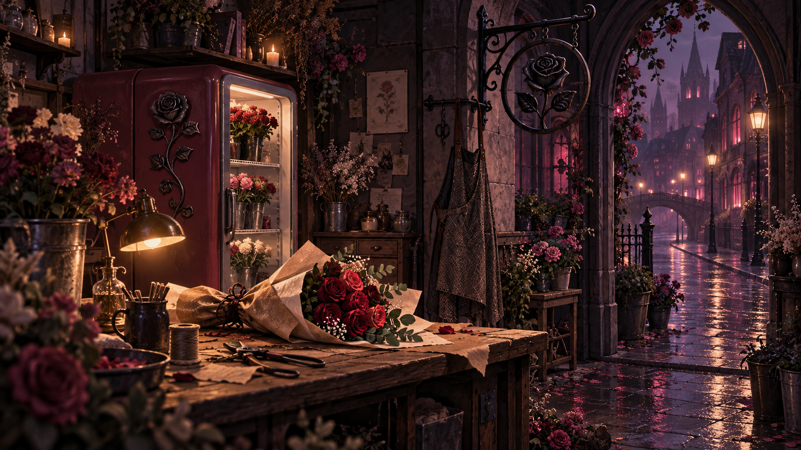
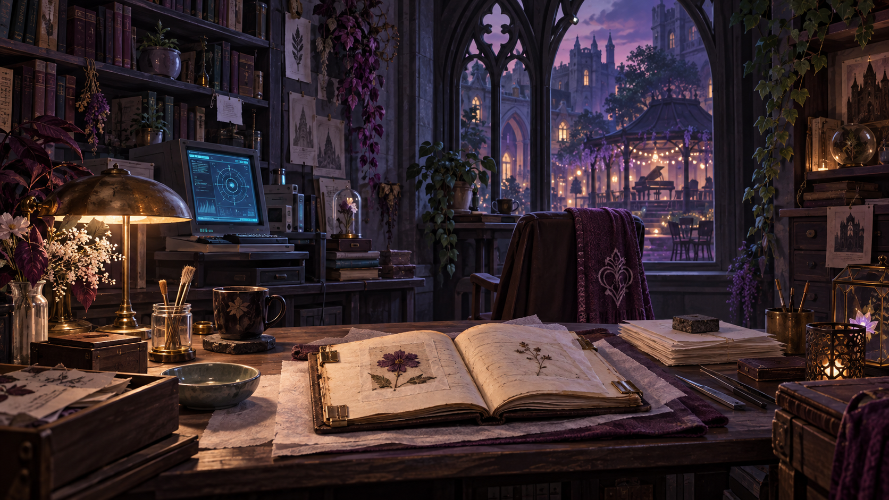
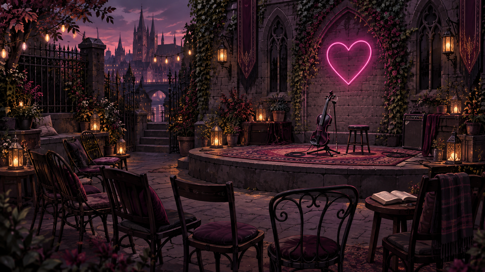
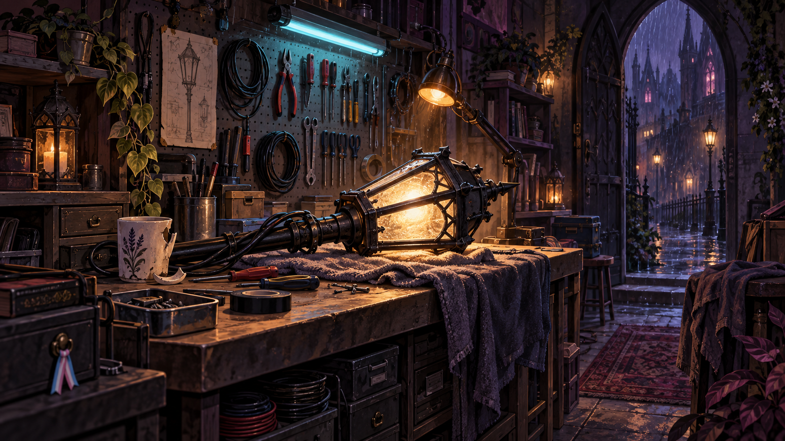
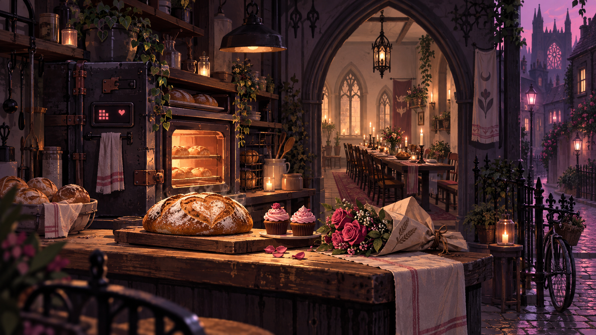
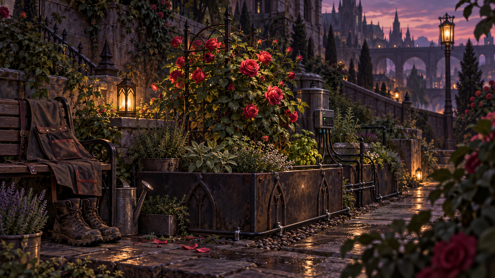

# Волна 03 — места шести соседей

Дата: 27.09.2026. Создано встроенным **image_gen**, шесть отдельных вызовов. Новая генерация по текстовому описанию; изображения-референсы не передавались в вызовы. Существующие меню и портреты были просмотрены для выбора художественного направления.

## Готовые ресурсы

Все PNG имеют фактический размер **1672×941**. Запрошенные 1536×864 генератор не сохранил буквально; `.tres` используют измеренный полный прямоугольник. Исходники скопированы без перекодирования. Это непрозрачные сюжетные иллюстрации, не текстуры мира, не карты и не спрайты.

| NPC | Содержание | PNG | Ресурс для существующего загрузчика |
|---|---|---|---|
| Иво | Цветочная мастерская, букет, повторно использованная бумага | `ivo_place_v1.png` | `ivo.tres` |
| Ноэль | Архив, реставрация страниц, окно к музыкальному двору | `noel_place_v1.png` | `noel.tres` |
| Люсьен | Небольшая сцена, инструмент, оставленная книга | `lucien_place_v1.png` | `lucien.tres` |
| Эш | Ремонт фонаря, инструменты, кружка без ручки | `ash_place_v1.png` | `ash.tres` |
| Эмиль | Пекарня, хлеб, цветы и общий стол | `emil_place_v1.png` | `emil.tres` |
| Ив | Сад у дороги, розы, автономный полив | `yves_place_v1.png` | `yves.tres` |

Общий каталог: `game/assets/illustrations/neighbors/`. Каждая `.tres` — AtlasTexture с полным прямоугольником отдельного изображения. Код уже загружает этот путь для `neighbors_<id>_city` через `art_texture`; изменения Rust для этой партии не требуются.

## Промпты и происхождение

Точные полные промпты каждого вызова, имена исходных файлов, размеры и связи с диалогами сохранены в [places_manifest.json](../game/assets/illustrations/neighbors/places_manifest.json). Это основной воспроизводимый журнал партии. Метод: built-in image_gen; без внешнего API, автоматической нарезки и дорисовки программным способом.

Общий запрос: романтический неоготический квартал, современная самодельная техника среди старого камня, одна доминанта, три пространственных плана, тёмная угольно-сливовая основа, локальный цветной свет, без людей, текста и UI. Индивидуальные детали взяты из уже существующих реплик шести жителей.

## Приёмка и ограничения

- Все шесть полных изображений просмотрены: общий язык материалов и света, разные смысловые центры, отсутствие персонажей и обрезанных лиц. Мелкие надписи на бумаге — декоративная фактура, не локализуемый текст.
- Файлы декодируются как PNG, размеры соответствуют manifest и AtlasTexture.
- Проверка `tools/verify_art_wave03.ps1` сопоставляет 6 ID, PNG, `.tres`, диалоги JSON/RON и сохранённые промпты.
- Статус **linked**, не `runtime_verified`: Godot не найден в PATH и проверенных стандартных путях; импорт, реальный экран 700×290 и экспорт в этой сессии не проверены.
- При `KEEP_ASPECT_CENTERED` рисунок 16:9 в панели 700×290 занимает около 515×290 с боковыми полями. Это ожидаемое сохранение пропорций, не ошибка файла. Если нужен полный широкий кадр, композицию нужно готовить под 700:290 отдельно.
- Экспорт пресета использует `all_resources`. Это предполагает включение новых импортированных ресурсов, но не заменяет проверку готовой сборки.
- Новых игровых интерьеров, квестов и наград эта партия не добавляет. Сценарный материал следующего эпизода находится в [пакете контента](CONTENT_PACK_NEIGHBORHOOD_01.md).

Следующая проверка в движке: открыть по очереди все шесть городских разговоров → убедиться в смене изображения → перейти к обычному портрету и обратно → проверить отсутствие старой текстуры, растяжения и перекрытия текста → повторить в экспортированной сборке. Использовать отдельный каталог пользовательских данных для проверки, не личное сохранение.

## Галерея

### Иво — цветочная мастерская

### Ноэль — архив

### Люсьен — музыкальный двор

### Эш — мастерская

### Эмиль — пекарня

### Ив — сад

